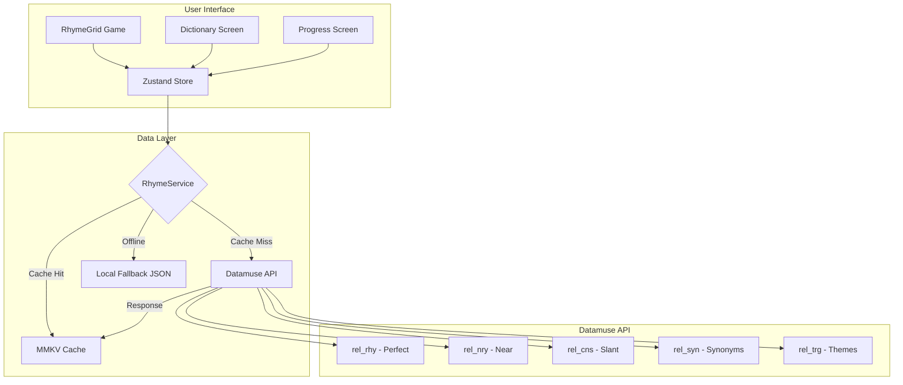

# feat: Migrate Rhyme Dictionary to Datamuse API

## Overview

Replace the local SQLite/JSON rhyme dictionary with the Datamuse API to unlock richer rhyme features including slant rhymes, semantic similarity, and thematic word relationships. This migration transforms FreestyleFlow from a fully offline app to a hybrid online/offline architecture.

## Problem Statement / Motivation

**Current State:**

- Local SQLite database (84.7MB source) with 42,682 words and 10,809 rhyme families
- Runtime filtered JSON (231KB) with top 10,000 common words
- Only 1-syllable rhyme families used in gameplay
- Limited to "perfect" rhymes with basic slant_words support
- App is 100% offline - all data bundled at build time

**Limitations:**

- Static dataset cannot be updated without app release
- Missing slant/near rhymes for many words
- No semantic relationships (synonyms, themes)
- No "sounds like" or phonetic matching
- 2.6MB JSON bundled for dictionary browsing

**Desired State:**

- Access Datamuse API's comprehensive rhyme database
- Perfect rhymes (`rel_rhy`) + near rhymes (`rel_nry`) + consonant matches (`rel_cns`)
- Semantic features: synonyms (`rel_syn`), triggers/themes (`rel_trg`), means-like (`ml`)
- Combined queries: words that rhyme AND have similar meaning
- Reduced app bundle size (remove large JSON files)
- Maintain offline fallback for core gameplay

## Proposed Solution

### High-Level Approach

Implement a **hybrid online/offline architecture**:

1. **Online-First**: Use Datamuse API as primary rhyme source
2. **Aggressive Caching**: Persist API responses to reduce calls and enable offline
3. **Local Fallback**: Keep curated dataset for offline gameplay
4. **Graceful Degradation**: Seamlessly switch between online/offline modes

### Architecture Diagram



## Technical Approach

### Key Files to Modify

| File                            | Changes                                                          |
| ------------------------------- | ---------------------------------------------------------------- |
| `store.ts`                      | Refactor `loadNewRhymes()` to use RhymeService, add pre-fetching |
| `app/dictionary.tsx`            | Replace local JSON lookup with API calls                         |
| `app/progress.tsx`              | Update family tracking to use word-based IDs                     |
| `utils/progress.ts`             | Migrate family_id to word-based progress tracking                |
| NEW: `services/datamuse.ts`     | API client with caching layer                                    |
| NEW: `services/rhymeService.ts` | Unified rhyme access (API + fallback)                            |
| NEW: `hooks/useRhymes.ts`       | TanStack Query hooks for rhyme data                              |

### Data Model Migration

**Current Family Structure:**

```typescript
interface RhymeFamily {
  family_id: string; // "UW1", "IY1"
  label: string; // "Q Family (-rew)"
  count: number;
  words: string[];
  slant_words?: string[];
}
```

**New Word-Based Structure:**

```typescript
interface RhymeGroup {
  seedWord: string; // The word we searched for
  groupId: string; // Hash of seedWord for tracking
  perfectRhymes: string[];
  nearRhymes: string[];
  slantRhymes: string[];
  syllableCount?: number;
  fetchedAt: number; // Timestamp for cache management
}
```

### Implementation Phases

#### Phase 1: Foundation - API Service Layer

**Goal**: Create Datamuse API client with caching

**Tasks:**

- [ ] Install dependencies: `@tanstack/react-query`, `react-native-mmkv`, `@react-native-community/netinfo`
- [ ] Create `services/datamuse.ts` - API client wrapper
- [ ] Create `services/rhymeCache.ts` - MMKV-based cache layer
- [ ] Create `services/rhymeService.ts` - Unified service with fallback logic
- [ ] Add network status detection hook
- [ ] Write unit tests for API client

**Files:**

### services/datamuse.ts

```typescript
const BASE_URL = "https://api.datamuse.com";

export interface DatamuseWord {
  word: string;
  score: number;
  numSyllables?: number;
}

export const datamuseApi = {
  // Perfect rhymes
  getRhymes: (word: string, max = 50): Promise<DatamuseWord[]> =>
    fetch(
      `${BASE_URL}/words?rel_rhy=${encodeURIComponent(word)}&max=${max}&md=s`,
    ).then(handleResponse),

  // Near/approximate rhymes
  getNearRhymes: (word: string, max = 30): Promise<DatamuseWord[]> =>
    fetch(
      `${BASE_URL}/words?rel_nry=${encodeURIComponent(word)}&max=${max}&md=s`,
    ).then(handleResponse),

  // Consonant match (slant rhymes)
  getSlantRhymes: (word: string, max = 20): Promise<DatamuseWord[]> =>
    fetch(
      `${BASE_URL}/words?rel_cns=${encodeURIComponent(word)}&max=${max}&md=s`,
    ).then(handleResponse),

  // Synonyms
  getSynonyms: (word: string, max = 30): Promise<DatamuseWord[]> =>
    fetch(
      `${BASE_URL}/words?rel_syn=${encodeURIComponent(word)}&max=${max}`,
    ).then(handleResponse),

  // Related by theme/topic
  getRelatedWords: (word: string, max = 30): Promise<DatamuseWord[]> =>
    fetch(
      `${BASE_URL}/words?rel_trg=${encodeURIComponent(word)}&max=${max}`,
    ).then(handleResponse),

  // Combined: rhymes with similar meaning
  getRhymesWithMeaning: (
    meaningWord: string,
    rhymeWord: string,
    max = 20,
  ): Promise<DatamuseWord[]> =>
    fetch(
      `${BASE_URL}/words?ml=${encodeURIComponent(meaningWord)}&rel_rhy=${encodeURIComponent(rhymeWord)}&max=${max}`,
    ).then(handleResponse),
};

async function handleResponse(response: Response): Promise<DatamuseWord[]> {
  if (response.status === 429) {
    throw new RateLimitError("Daily API limit exceeded");
  }
  if (!response.ok) {
    throw new ApiError(response.status, await response.text());
  }
  return response.json();
}
```

### services/rhymeCache.ts

```typescript
import { MMKV } from "react-native-mmkv";

const cache = new MMKV({ id: "rhyme-cache" });
const CACHE_TTL_MS = 7 * 24 * 60 * 60 * 1000; // 7 days

export interface CachedRhymeGroup {
  seedWord: string;
  groupId: string;
  perfectRhymes: string[];
  nearRhymes: string[];
  slantRhymes: string[];
  fetchedAt: number;
}

export function getCachedRhymes(word: string): CachedRhymeGroup | null {
  const key = `rhymes:${word.toLowerCase()}`;
  const cached = cache.getString(key);
  if (!cached) return null;

  const data: CachedRhymeGroup = JSON.parse(cached);
  if (Date.now() - data.fetchedAt > CACHE_TTL_MS) {
    cache.delete(key);
    return null;
  }
  return data;
}

export function setCachedRhymes(data: CachedRhymeGroup): void {
  const key = `rhymes:${data.seedWord.toLowerCase()}`;
  cache.set(key, JSON.stringify(data));
}

export function generateGroupId(seedWord: string): string {
  // Simple hash for tracking - consistent across sessions
  return `grp_${seedWord.toLowerCase()}`;
}
```

---

#### Phase 2: Game Integration

**Goal**: Integrate API into gameplay without breaking real-time performance

**Strategy**: Pre-fetch rhyme groups on game start, maintain buffer during play

**Tasks:**

- [ ] Refactor `loadNewRhymes()` to use pre-fetched pool
- [ ] Implement rhyme pool pre-loading on game start
- [ ] Add background refresh to maintain buffer during gameplay
- [ ] Update `shiftBoard()` to use buffered rhymes
- [ ] Implement offline detection and fallback switching
- [ ] Add loading state UI for initial game load

**Key Change - Pre-fetch Pool Pattern:**

### store.ts (modified loadNewRhymes)

```typescript
interface GameState {
  // ... existing state ...
  rhymePool: RhymeGroup[];        // Pre-fetched rhyme groups
  poolIndex: number;              // Current position in pool
  isLoadingPool: boolean;         // Loading state for UI
  isOnline: boolean;              // Network status
}

// Called on game start - pre-fetch 20 rhyme groups
prefetchRhymePool: async () => {
  set({ isLoadingPool: true });

  const seedWords = getRandomSeedWords(20); // From common words list
  const groups = await Promise.all(
    seedWords.map(word => rhymeService.getRhymeGroup(word))
  );

  set({
    rhymePool: groups.filter(Boolean),
    poolIndex: 0,
    isLoadingPool: false
  });
},

// Modified to use pool instead of direct API call
loadNewRhymes: () => {
  set((state) => {
    const group = state.rhymePool[state.poolIndex];
    if (!group) {
      // Fallback to local data if pool exhausted
      return loadFromLocalFallback(state);
    }

    // ... existing logic using group.perfectRhymes ...

    return {
      ...state,
      poolIndex: state.poolIndex + 1,
    };
  });

  // Trigger background refresh if pool running low
  if (get().poolIndex > get().rhymePool.length - 5) {
    get().refreshPoolInBackground();
  }
},
```

---

#### Phase 3: Dictionary Screen Migration

**Goal**: Replace local JSON browsing with API-powered search

**Tasks:**

- [ ] Create `useRhymeSearch` hook with debounced API calls
- [ ] Update Dictionary UI to show loading/error states
- [ ] Replace syllable browsing with search-first UX
- [ ] Add "rhyme type" tabs: Perfect | Near | Slant | Related
- [ ] Implement result caching for searched words
- [ ] Add offline indicator when using cached results

**UI Changes:**

```
BEFORE:
┌─────────────────────────────────┐
│ [Search box]                    │
│ [1 SYL] [2 SYL] [3 SYL] [4+]   │  ← Browse by syllable
│ ─────────────────────────────── │
│ Family: "UW1" (-oo sound)       │
│ Words: do, to, boo, new, you... │
└─────────────────────────────────┘

AFTER:
┌─────────────────────────────────┐
│ [Search: "flow"]           [🔍] │
│ [Perfect] [Near] [Slant] [More] │  ← Rhyme type tabs
│ ─────────────────────────────── │
│ Perfect rhymes for "flow":      │
│ go, know, show, grow, blow...   │
│                                 │
│ [📶 Online] or [📴 Cached]      │
└─────────────────────────────────┘
```

---

#### Phase 4: Progress & Tracking Migration

**Goal**: Update progress tracking to work with word-based groups

**Tasks:**

- [ ] Migrate `FamilyProgress` to `WordProgress` schema
- [ ] Update ProgressService to use groupId (word-based)
- [ ] Create migration script for existing user progress
- [ ] Update Progress screen UI to show practiced words
- [ ] Implement "Practice Weakest" using word frequency

**Data Migration:**

```typescript
// OLD: family_id based
{ "UW1": { timesPlayed: 5, lastPlayed: "2025-01-15" } }

// NEW: word-based groupId
{ "grp_flow": { timesPlayed: 5, lastPlayed: "2025-01-15", seedWord: "flow" } }
```

---

#### Phase 5: Advanced Features (Future)

**Goal**: Unlock Datamuse's semantic capabilities

**Tasks:**

- [ ] Add "Thematic Rhymes" mode - rhymes related to a topic
- [ ] Implement "Meaning + Rhyme" combined search
- [ ] Add "Sounds Like" feature for phonetic exploration
- [ ] Create "Word Flow" suggestions (words that follow/precede)

## Acceptance Criteria

### Functional Requirements

- [ ] Game loads rhymes from Datamuse API when online
- [ ] Game falls back to local data when offline
- [ ] API responses are cached for 7 days
- [ ] Dictionary search returns perfect, near, and slant rhymes
- [ ] Progress tracking works with new word-based IDs
- [ ] User sees loading state during initial game load (<2 seconds target)
- [ ] Error states show user-friendly messages with retry option

### Non-Functional Requirements

- [ ] API latency < 500ms p95 (with caching: <50ms)
- [ ] Offline fallback activates within 1 second of network loss
- [ ] App stays under 100,000 API calls/day with 1,000 DAU
- [ ] Cache storage < 10MB after heavy usage
- [ ] No perceivable lag during gameplay (pre-fetch buffer works)

### Quality Gates

- [ ] Unit tests for API client, cache layer, and rhyme service
- [ ] Integration tests for online/offline switching
- [ ] Manual testing on airplane mode
- [ ] Load testing to verify rate limit math

## Dependencies & Prerequisites

**Required:**

- Datamuse API (free tier: 100,000 requests/day)
- Network connectivity for initial data fetch

**New Dependencies:**

```json
{
  "@tanstack/react-query": "^5.x",
  "react-native-mmkv": "^2.x",
  "@react-native-community/netinfo": "^11.x"
}
```

**Existing Dependencies (no changes):**

- Zustand (state management)
- AsyncStorage (user progress - consider migrating to MMKV)

## Risk Analysis & Mitigation

| Risk                        | Severity | Mitigation                                                      |
| --------------------------- | -------- | --------------------------------------------------------------- |
| **Offline breakage**        | Critical | Keep local JSON as fallback, test airplane mode extensively     |
| **Rate limit exceeded**     | Critical | Aggressive caching (7-day TTL), pool pre-fetching reduces calls |
| **API latency during game** | High     | Pre-fetch pool on game start, never call API mid-game           |
| **Progress data loss**      | High     | Migration script with backup, keep old data until confirmed     |
| **API service outage**      | Medium   | Graceful fallback to local, show "offline mode" indicator       |
| **Word quality issues**     | Medium   | Filter results against common-words list, add blocklist         |

### Rate Limit Math

```
Free tier: 100,000 requests/day

Per game session (3 minutes):
- Pre-fetch pool: 20 API calls (one-time)
- Background refresh: ~10 calls
- Total: ~30 calls/session

Per dictionary search:
- 1 call for perfect rhymes
- 1 call for near rhymes (if tab selected)
- Total: 1-2 calls/search

Conservative estimate per user/day:
- 5 game sessions: 150 calls
- 10 dictionary searches: 20 calls
- Total: ~170 calls/user/day

Max users at free tier: ~580 DAU
```

**If we exceed limits**: Contact Datamuse for commercial tier, or implement request queuing.

## Success Metrics

| Metric                          | Current | Target                            |
| ------------------------------- | ------- | --------------------------------- |
| App bundle size (rhyme data)    | 2.8MB   | < 500KB                           |
| Rhyme variety (unique families) | 10,809  | Unlimited (API)                   |
| Slant rhyme coverage            | Partial | Full (rel_nry + rel_cns)          |
| Offline capability              | 100%    | 100% (with fallback)              |
| Game load time                  | <100ms  | <2s (first load), <100ms (cached) |

## Future Considerations

1. **Paid Datamuse tier**: If DAU exceeds 500, evaluate commercial options
2. **Custom vocabulary**: Datamuse supports custom word lists (`v=` parameter)
3. **Multi-language**: Datamuse has Spanish (`v=es`) and Wikipedia vocabularies
4. **User favorites**: Let users save favorite rhyme groups locally
5. **AI-powered suggestions**: Combine with LLM for contextual rhyme recommendations

## References & Research

### Internal References

- `store.ts:142-238` - Current `loadNewRhymes()` implementation
- `app/data/rhyme_levels_filtered.json` - Current runtime data
- `app/dictionary.tsx:31-52` - Current search logic
- `utils/progress.ts` - Current progress tracking

### External References

- [Datamuse API Documentation](https://www.datamuse.com/api/)
- [TanStack Query - React Native Setup](https://tanstack.com/query/latest/docs/framework/react/react-native)
- [MMKV - Fast Key-Value Storage](https://github.com/mrousavy/react-native-mmkv)
- [NetInfo - Network Detection](https://github.com/react-native-netinfo/react-native-netinfo)

### Datamuse API Quick Reference

| Feature        | Endpoint Parameter |
| -------------- | ------------------ |
| Perfect rhymes | `rel_rhy=word`     |
| Near rhymes    | `rel_nry=word`     |
| Slant rhymes   | `rel_cns=word`     |
| Synonyms       | `rel_syn=word`     |
| Related/themes | `rel_trg=word`     |
| Sounds like    | `sl=word`          |
| Means like     | `ml=word`          |
| With syllables | `&md=s`            |
| Limit results  | `&max=50`          |

---

Generated with [Claude Code](https://claude.ai/claude-code) - 2025-01-30
